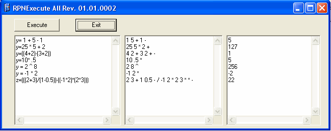

## RPN Demo

### Description

Calculator

Parses String Equation

Orders Parsed equation to RPN (reverse polish notation)

Solves RPN equation
 
### More Info
 
Input equation in right window.

Solved equation

             |
---                |---
**Submitted On**   |2005-08-02 11:07:34
**By**             |[rlblanch](https://github.com/Planet-Source-Code/PSCIndex/blob/master/ByAuthor/rlblanch.md)
**Level**          |Advanced
**User Rating**    |4.7 (14 globes from 3 users)
**Compatibility**  |VB 6\.0
**Category**       |[Complete Applications](https://github.com/Planet-Source-Code/PSCIndex/blob/master/ByCategory/complete-applications__1-27.md)
**World**          |[Visual Basic](https://github.com/Planet-Source-Code/PSCIndex/blob/master/ByWorld/visual-basic.md)
**Archive File**   |[RPN\_Demo192022822005\.zip](https://github.com/Planet-Source-Code/rlblanch-rpn-demo__1-62045/archive/master.zip)

